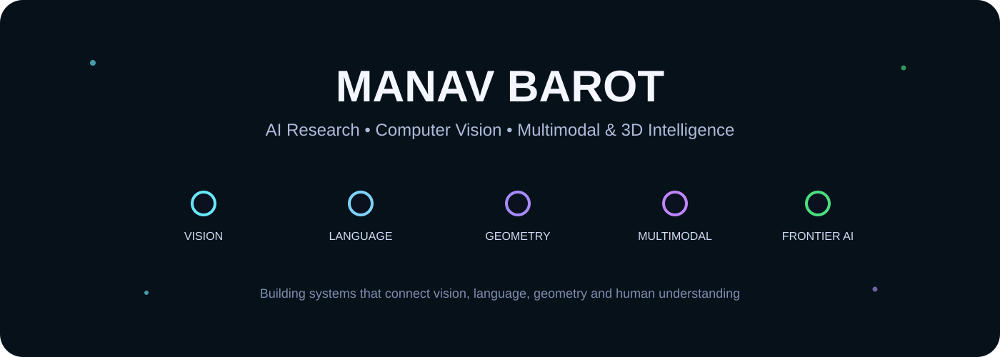
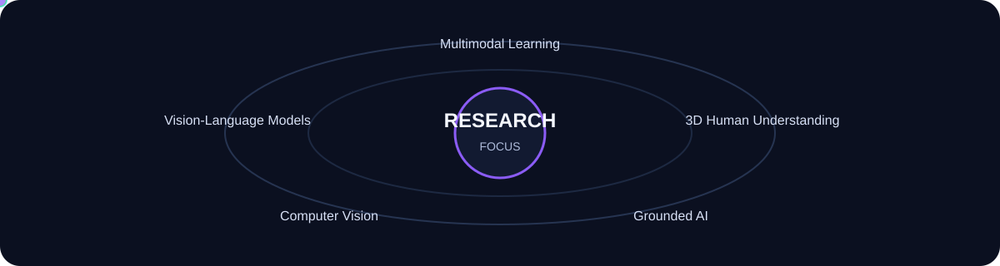

  

<h1 align="center">Hi, I'm Manav Barot</h1>

  <strong>Ph.D. Candidate · AI Research · Computer Vision · Vision-Language Models · Multimodal & 3D AI</strong>

  Building systems that connect <strong>vision, language, geometry, and human understanding</strong>.

  <a href="https://www.linkedin.com/in/themnvrao76/"><strong>LinkedIn</strong></a>
  &nbsp;•&nbsp;
  <a href="https://github.com/themnvrao76"><strong>GitHub</strong></a>
  &nbsp;•&nbsp;
  <a href="#featured-projects"><strong>Featured Projects</strong></a>
  &nbsp;•&nbsp;
  <a href="#research-focus"><strong>Research Focus</strong></a>

---

## About Me

I am a Ph.D. candidate at the **State University of New York at Binghamton** working at the intersection of computer vision, vision-language models, multimodal learning, and 3D human understanding.

My current research explores how visual models can reason beyond appearance by incorporating **geometry, structured human-pose information, and natural language**. I am especially interested in grounded multimodal systems that can explain, compare, correct, and reason about complex visual states.

I enjoy building research systems end-to-end: dataset design, model training, evaluation, multimodal reasoning, experimentation, and deployment.

---

## Currently Building

<table>
<tr>
<td width="33%" valign="top">

### Pose + Language
Vision-language systems for fine-grained human-pose understanding, comparison, and correction.

</td>
<td width="33%" valign="top">

### 3D + Geometry
Using body geometry and structured spatial signals to improve visual reasoning.

</td>
<td width="33%" valign="top">

### AI Foundations
Open repositories that trace the evolution of computer vision, NLP, and modern AI.

</td>
</tr>
</table>

---

## Featured Projects

<table>
<tr>
<td width="33%" valign="top">

### Classical → Modern Computer Vision
**Landmark CV architectures implemented in PyTorch**

LeNet, AlexNet, ResNet, DenseNet, MobileNet, EfficientNet, Vision Transformers and an expanding path into detection, segmentation, pose, multimodal and 3D vision.

**[Explore the repository →](https://github.com/themnvrao76/Classical-to-Modern-Computer-Vision)**

</td>
<td width="33%" valign="top">

### Classical → Modern NLP
**From Word2Vec to modern LLM systems**

A chronological PyTorch journey through embeddings, recurrent networks, attention, Transformers, pretrained language models, PEFT, RAG and modern language-model components.

**[Explore the repository →](https://github.com/themnvrao76/Classical-to-Modern-NLP)**

</td>
<td width="33%" valign="top">

### AI Roadmap — Scratch → Frontier
**A research-oriented AI learning roadmap**

Foundations, machine learning, deep learning, CV, NLP, LLMs, RAG, agents, diffusion, multimodal AI, reinforcement learning, AI systems, 3D vision and frontier research.

**[Explore the roadmap →](https://github.com/themnvrao76/AI-Roadmap-From-Scratch-to-Frontier)**

</td>
</tr>
</table>

---

## Research Focus

  

| Area | What interests me |
|---|---|
| **Vision-Language Models** | Fine-grained reasoning that connects image content with natural language |
| **3D Human Understanding** | Pose, body geometry, spatial structure and human-centric reasoning |
| **Multimodal Learning** | Learning shared representations across vision, language and structured signals |
| **Grounded AI** | Systems whose language is tied to observable visual or geometric evidence |
| **Computer Vision** | Recognition, representation learning, segmentation, pose and visual understanding |

---

## Research Direction

> **Can multimodal models reason about the structure of a visual scene—not only describe what is visible, but understand geometry, relationships, alignment, and how something should change?**

That question drives much of my current work.

My research interests include:

- vision-language reasoning
- human pose understanding
- 3D body geometry
- grounded multimodal models
- fine-grained visual comparison
- natural-language correction and feedback
- multimodal dataset design
- evaluation for spatial and geometric reasoning
- self-supervised visual representations
- efficient AI systems

---

## Technical Toolkit

<table>
<tr>
<td width="25%" valign="top">

### Deep Learning
PyTorch  
Transformers  
CNNs  
Vision Transformers  
Contrastive Learning

</td>
<td width="25%" valign="top">

### Vision
OpenCV  
Segmentation  
Pose Estimation  
3D Human Understanding  
Visual Representation Learning

</td>
<td width="25%" valign="top">

### Language + Multimodal
LLMs  
VLMs  
RAG  
LoRA / PEFT  
Multimodal Evaluation

</td>
<td width="25%" valign="top">

### Systems
Python  
Linux  
Git  
GPU Training  
Experiment Pipelines

</td>
</tr>
</table>

---

## How I Like to Work

**Understand the paper → reproduce the core idea → build the system → evaluate failures → improve the reasoning.**

I care about:

- experiments that answer a clear question
- datasets with explicit provenance and evaluation
- reproducible training
- strong baselines
- failure analysis
- interpretable geometric or visual signals
- research that can become a usable system

---

## Selected Learning & Reference Repositories

These repositories are intentionally designed as long-running references rather than one-off demos.

| Repository | Purpose |
|---|---|
| **[Classical-to-Modern-Computer-Vision](https://github.com/themnvrao76/Classical-to-Modern-Computer-Vision)** | Trace the architectural evolution of computer vision |
| **[Classical-to-Modern-NLP](https://github.com/themnvrao76/Classical-to-Modern-NLP)** | Trace the evolution of NLP and language models |
| **[AI-Roadmap-From-Scratch-to-Frontier](https://github.com/themnvrao76/AI-Roadmap-From-Scratch-to-Frontier)** | A deep learning path from fundamentals to frontier AI |

---

<strong>More about my research interests</strong>

 

I am particularly interested in AI systems that operate at the intersection of:

**Visual perception**  
What is present in an image or scene?

**Geometry**  
How are objects, body parts, and spatial structures positioned relative to one another?

**Language**  
Can the system express its understanding naturally and precisely?

**Reasoning**  
Can it compare observations, detect subtle differences, explain them, and recommend a correction?

**Grounding**  
Can every claim be connected back to visible or measurable evidence?

These questions are especially important for human-centric vision, embodied systems, visual assistants, and multimodal reasoning.

---

## Open to

Research and engineering opportunities involving:

**Computer Vision · Multimodal AI · Vision-Language Models · 3D Human Understanding · Foundation Models · Applied AI Research**

---

  <strong>Building AI that sees, understands, and reasons.</strong>

  <a href="https://www.linkedin.com/in/themnvrao76/">LinkedIn</a>
  &nbsp;•&nbsp;
  <a href="https://github.com/themnvrao76">GitHub</a>

